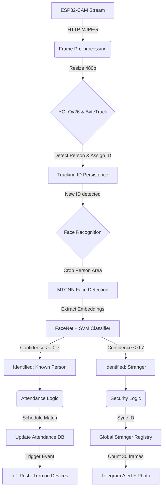

# 🚀 Báo cáo Cập nhật Dự án: Hệ thống Quản lý và Điểm danh thông minh (Smart FaceID Attendance)

Chào mừng bạn đến với phiên bản nâng cấp toàn diện của dự án **Employee Management System**. Trong đợt cập nhật này, chúng tôi đã tái cấu trúc hệ thống từ cốt lõi, chuyển đổi sang kiến trúc IoT hiện đại và tối ưu hóa luồng xử lý AI.

---

## 📡 1. Nâng cấp Hệ thống Thu nhận Hình ảnh: ESP32-CAM
*   **Kiến trúc IP Camera Không dây**: Thay thế hoàn toàn các webcam USB bằng module **ESP32-CAM**. Hệ thống giờ đây hỗ trợ vô số luồng stream không dây qua giao thức HTTP, cho phép lắp đặt linh hoạt ở bất kỳ vị trí nào có sóng Wi-Fi.
*   **Quản lý tập trung**: Bổ sung model `IPCamera` giúp lưu trữ và cấu hình tham số cho từng camera riêng biệt (IP, Tên, Chế độ hoạt động) trực tiếp từ cơ sở dữ liệu.

## 🧠 2. Module hóa Logic Điểm danh & Nhận diện
*   **Kiểm soát Độc lập**: Mỗi Camera giờ đây có thể được cấu hình riêng:
    *   `Attendance Mode`: Chỉ thực hiện điểm danh.
    *   `Tracking Mode`: Tự động phát hiện và cảnh báo người lạ.
*   **Tracker thông minh**: Triển khai `facerecognition/tracker.py` giúp duy trì ID đối tượng, giảm thiểu việc nhận diện lặp lại và tối ưu hóa hiệu suất xử lý.

## ⚡ 3. Đột phá Công nghệ IoT: Push Model (Master-Slave)
> [!IMPORTANT]
> Đây là thay đổi kiến trúc quan trọng nhất. Chúng tôi đã chuyển đổi từ cơ chế "Hỏi - Đáp" (Polling) truyền thống sang mô hình **"Ra lệnh trực tiếp" (Push Model)**.

*   **ESP32 Child API**: Mỗi bộ điều khiển ESP32 giờ đây đóng vai trò là một **API Server** thu nhỏ.
    *   **Backend (Django Master)**: Sử dụng hàm `send_command_to_esp32` để chủ động gọi lệnh tới thiết bị ngay khi có sự kiện (VD: Sinh viên vào lớp -> Bật quạt ngay lập tức).
    *   **Firmware (ESP32 Slave)**: Chạy WebServer tại cổng 80, hỗ trợ endpoint `/control` nhận lệnh với độ trễ cực thấp (< 100ms).
*   **IP Management Dashboard**: Giao diện quản lý thiết bị được nâng cấp, cho phép cập nhật IP của ESP32 trực tiếp trên Web UI mà không cần can thiệp vào mã nguồn phần cứng.

## 🎨 4. Nâng cấp Trải nghiệm Người dùng (UI/UX)
*   **Grid Layout & Responsive**: Trang quản lý camera sử dụng Bootstrap Grid, tối ưu hiển thị đa luồng stream cùng lúc.
*   **Modal Zoom**: Tính năng nhấp để phóng to camera giúp giám sát chi tiết hơn mà không làm gián đoạn luồng stream chung.
*   **Cảnh báo Thị giác**: Tự động Highlight (nhấn mạnh) các khung hình camera khi phát hiện đối tượng nghi vấn hoặc người lạ.

## 🤖 5. Tối ưu hóa Mô hình AI & Dữ liệu
*   **YOLOv26 Nano (NMS-Free Detection)**: Nâng cấp lên kiến trúc YOLOv26 mới nhất từ Ultralytics (phát hành đầu năm 2026). Mô hình này sử dụng thiết kế **NMS-Free** giúp loại bỏ hoàn toàn độ trễ hậu xử lý, tối ưu hóa vượt trội cho các thiết bị Edge và đảm bảo tốc độ xử lý Real-time mượt mà cho toàn bộ hệ thống camera.
*   **Data Augmentation**: Bổ sung dữ liệu khuôn mặt thô với đa dạng góc độ và điều kiện ánh sáng, giúp model FaceNet đạt độ chính xác cao hơn trong môi trường thực tế.
## 🔍 6. Luồng Hoạt động Nhận diện Hiện tại (Recognition Pipeline)

Hệ thống sử dụng một pipeline xử lý đa tầng, kết hợp giữa Detection, Tracking và Recognition để đảm bảo độ chính xác và hiệu suất thời gian thực.

### Chi tiết các bước xử lý:
1.  **Thu nhận & Tiền xử lý**: Frame được lấy từ luồng MJPEG của ESP32-CAM, sau đó resize về chiều rộng 480px để cân bằng giữa độ chính xác nhận diện và FPS xử lý.
2.  **Detection & Tracking**: Sử dụng **YOLOv26 Nano** để phát hiện người. Kết hợp với thuật toán **ByteTrack** để duy trì `track_id` cho mỗi cá nhân, giúp hệ thống không phải nhận diện khuôn mặt liên tục ở mọi frame (tiết kiệm CPU/GPU).
3.  **Nhận diện Khuôn mặt (Recognition)**:
    *   Chỉ thực hiện khi một `track_id` mới xuất hiện hoặc chưa được xác định.
    *   **MTCNN**: Tìm vị trí khuôn mặt chính xác trong vùng ảnh người đã crop.
    *   **FaceNet + SVM**: Trích xuất đặc trưng (128-d embeddings) và phân loại qua mô hình SVM đã huấn luyện.
4.  **Xử lý Logic & Tích hợp**:
    *   **Điểm danh & IoT**: Nếu là người quen, hệ thống đối soát với lịch học (`CalendarEvent`). Nếu khớp, thực hiện điểm danh và **gửi lệnh HTTP Push** để bật thiết bị (đèn, quạt) tại phòng tương ứng.
    *   **Cảnh báo Người lạ**: Nếu là người lạ, hệ thống đồng bộ ID qua `Global Stranger Registry` (sử dụng khoảng cách Euclidean). Nếu người lạ xuất hiện quá 30 frame, một cảnh báo kèm ảnh sẽ được gửi tới **Telegram Admin**.
